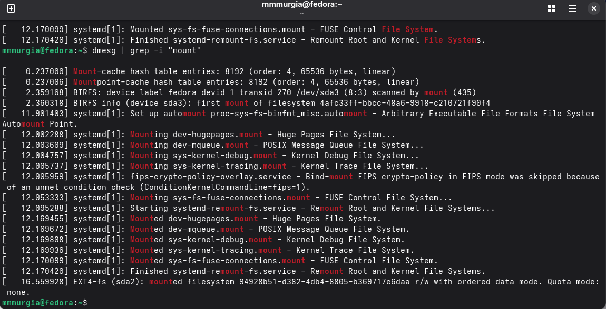

---
## Author
author:
  name: Мургия Марк Максимович
  degrees: DSc
  orcid: 0009-0006-9370-0808
  email: 1132243817@rudn.ru
  affiliation:
    - name: Российский университет дружбы народов
      country: Российская Федерация
      postal-code: 117198
      city: Москва
      address: ул. Миклухо-Маклая, д. 6

## Title
title: "Отчет Лабораторной работы №1"
subtitle: "Установка операционной системы"
license: "CC BY"
---

# Цель работы

Целью данной работы является приобретение практических навыков установки операционной системы на виртуальную машину, настройки минимально необходимых для дальнейшей работы сервисов.

# Задание

1. Установить ОС Fedora Linux
2. Установить программы (Termux, TexLive)
3. Найти данные о системе через dmesg

# Теоретическое введение

Здесь описываются теоретические аспекты, связанные с выполнением работы.

Например, в [табл. @tbl-std-dir] приведено краткое описание стандартных каталогов Unix.

| Имя каталога | Описание каталога                                                                                                          |
|--------------|----------------------------------------------------------------------------------------------------------------------------|
| `/`          | Корневая директория, содержащая всю файловую                                                                               |
| `/bin `      | Основные системные утилиты, необходимые как в однопользовательском режиме, так и при обычной работе всем пользователям     |
| `/etc`       | Общесистемные конфигурационные файлы и файлы конфигурации установленных программ                                           |
| `/home`      | Содержит домашние директории пользователей, которые, в свою очередь, содержат персональные настройки и данные пользователя |
| `/media`     | Точки монтирования для сменных носителей                                                                                   |
| `/root`      | Домашняя директория пользователя  `root`                                                                                   |
| `/tmp`       | Временные файлы                                                                                                            |
| `/usr`       | Вторичная иерархия для данных пользователя                                                                                 |

: Описание некоторых каталогов файловой системы GNU Linux {#tbl-std-dir}

Более подробно про Unix см. в [@tanenbaum_book_modern-os_ru; @robbins_book_bash_en; @zarrelli_book_mastering-bash_en; @newham_book_learning-bash_en].

# Выполнение лабораторной работы

Первым делом мы создаем виртуальную машину используя образ Linux от дистрибутива Fedora. После включения машины, мы устанавливаем операционную систему и вытаксиваем виртуальный образ ОС. Установлим development-tools, tmux, texlive и найдем данные о нашей ОС.([рис. @fig-001])

1. Linux version 6.17.1-300.fc43.x86_64
2. Detected 2208.000 MHz processor
3. Intel(R) Core(TM) i7-8750H CPU @ 2.20GHz
4. 3938080K/4193848K available
5. Hypervisor detected: KVM
6. initrd-switch-root
7. 

{#fig-001 width=70%}

# Выводы

Мы приобрели практические навыки установки операционной системы на виртуальную машину, настройки минимально необходимых для дальнейшей работы сервисов.

# Список литературы{.unnumbered}

::: {#refs}
:::
