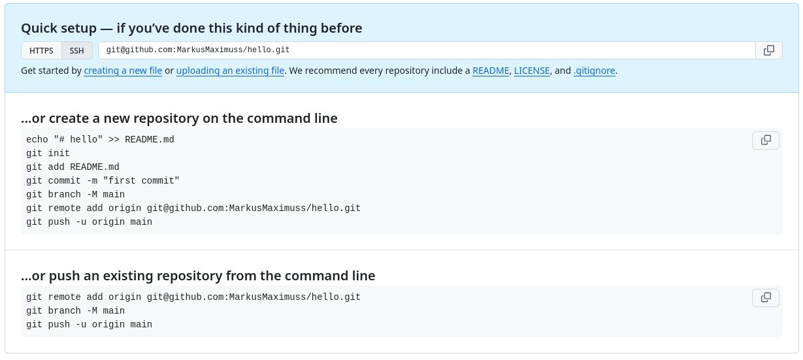

---
## Author
author:
  name: Мургия Марк Максимович
  degrees: DSc
  orcid: 0009-0006-9370-0808
  email: 1132243817@rudn.ru
  affiliation:
    - name: Российский университет дружбы народов
      country: Российская Федерация
      postal-code: 117198
      city: Москва
      address: ул. Миклухо-Маклая, д. 6

## Title
title: "Отчет Лабораторной работы №2"
subtitle: "Первоначальна настройка git"
license: "CC BY"
---

# Цель работы

Целью данной работы является настройка git и создание репозитория на Github.

# Задание

1. Изучить идеологию и применение средств контроля версий
2. Освоить умения по работе с git

# Теоретическое введение

Здесь описываются теоретические аспекты, связанные с выполнением работы.

| core.autocrlf  | false        | input        | true         |
|----------------|--------------|--------------|--------------|
| `git commit`   | LF -> LF     | LF -> LF     | LF -> CRLF   |
|                | CR -> CR     | CR -> CR     | CR -> CR     |
|                | CRLF -> CRLF | CRLF -> LF   | CRLF -> CRLF |
| `git checkout` | LF -> LF     | LF -> LF     | LF -> CRLF   |
|                | CR -> CR     | CR -> CR     | CR -> CR     |
|                | CRLF -> CRLF | CRLF -> CRLF | CRLF -> CRLF |

: Варианты конвертации для разных значений параметра core.autocrlf {#tbl-std-dir}

Более подробно про Unix см. в [@tanenbaum_book_modern-os_ru; @robbins_book_bash_en; @zarrelli_book_mastering-bash_en; @newham_book_learning-bash_en].

# Выполнение лабораторной работы

После установления git, можно создать директорию, в котором будет находиться новый репозиторий ([рис. @fig-001]). Мы также создадим SSH и GPG для подключения к репозиторию на Github.

{#fig-001 width=70%}

# Выводы

Мы изучили идеологию и применение средств контроля версий и освоили умения по работе с git.

# Список литературы{.unnumbered}

::: {#refs}
:::
