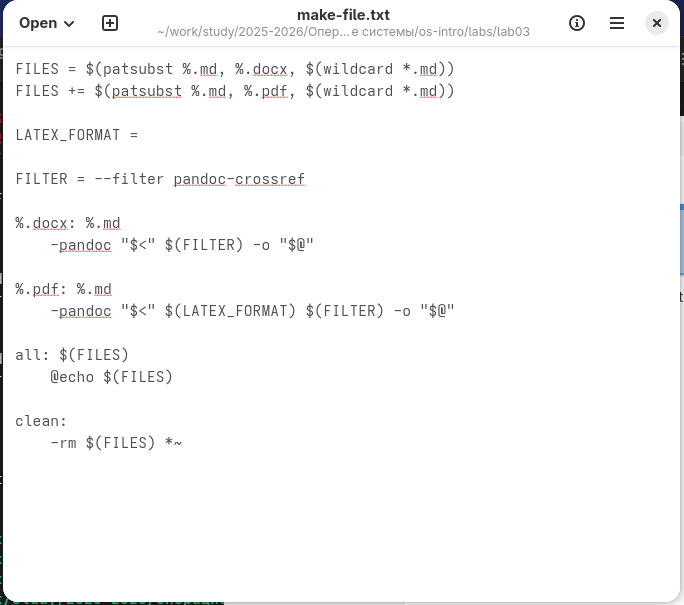

---
## Author
author:
  name: Мургия Марк Максимович
  degrees: DSc
  orcid: 0009-0006-9370-0808
  email: 1132243817@rudn.ru
  affiliation:
    - name: Российский университет дружбы народов
      country: Российская Федерация
      postal-code: 117198
      city: Москва
      address: ул. Миклухо-Маклая, д. 6

## Title
title: "Отчет Лабораторной работы №3"
subtitle: "Markdown"
license: "CC BY"
---

# Цель работы

Научиться оформлять отчеты с помощью легковесного языка разметки Markdown.

# Задание

Написать отчет лабораторной работы с помощью Markdown.

# Теоретическое введение

Этот текст **полужирный**.

Этот текст *курсивный*.

Этот текст ***полужирный и курсивный***.

- Неупорядоченный
- немаркированный
- список

1. Номер 1
2. Номер 2
3. Номер 3

H~2~O

2^10^

$\sin^2 (x) + \cos^2 (x) = 1$

# Выполнение лабораторной работы

Файлы Markdown создаются через MakeFile ([рис. @fig-001]). Нужно также установить pandoc.

{#fig-001 width=70%}

# Выводы

Мы научились оформлять отчеты с помощью легковесного языка разметки Markdown.

# Список литературы{.unnumbered}

::: {#refs}
:::
