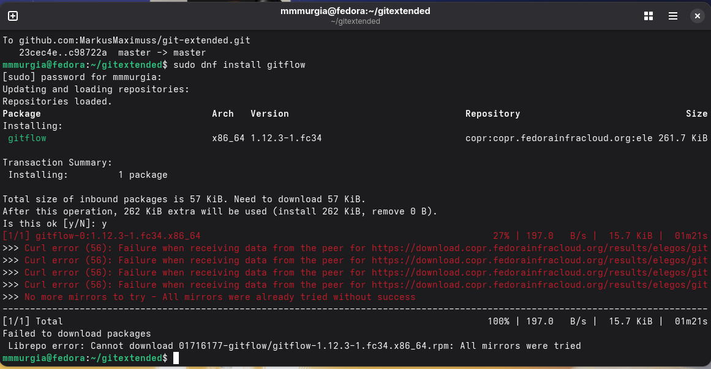

---
## Author
author:
  name: Мургия Марк Максимович
  degrees: DSc
  orcid: 0009-0006-9370-0808
  email: 1132243817@rudn.ru
  affiliation:
    - name: Российский университет дружбы народов
      country: Российская Федерация
      postal-code: 117198
      city: Москва
      address: ул. Миклухо-Маклая, д. 6

## Title
title: "Отчет Лабораторной работы №4"
subtitle: "Продвинутое использование Git"
license: "CC BY"
---

# Цель работы

Получение навыков правильной работы с репозиториями git.

# Задание

- Установить gitflow, pnpm, NodeJS
- Сделать репозиторий git-extended

# Теоретическое введение

Предупреждаю, что у данной лабораторной работы произошлы неполадки в связи с gitflow. Программу не удалось установить, так как поддержка остановилась несколько лет назад.

{#fig-001 width=70%}

# Выполнение лабораторной работы

После установки gitflow, NodeJS, pnpm, нужно подготовить новый репозиторий в GitHub. Этот репозиторий будет называться git-extended, и мы создадим в нем файл .json. Gitflow предполагает выстраивание строгой модели ветвления с учетом выпуска проэкта.

# Выводы

Мы получили навыки правильной работы с репозиториями git.

# Список литературы{.unnumbered}

::: {#refs}
:::
