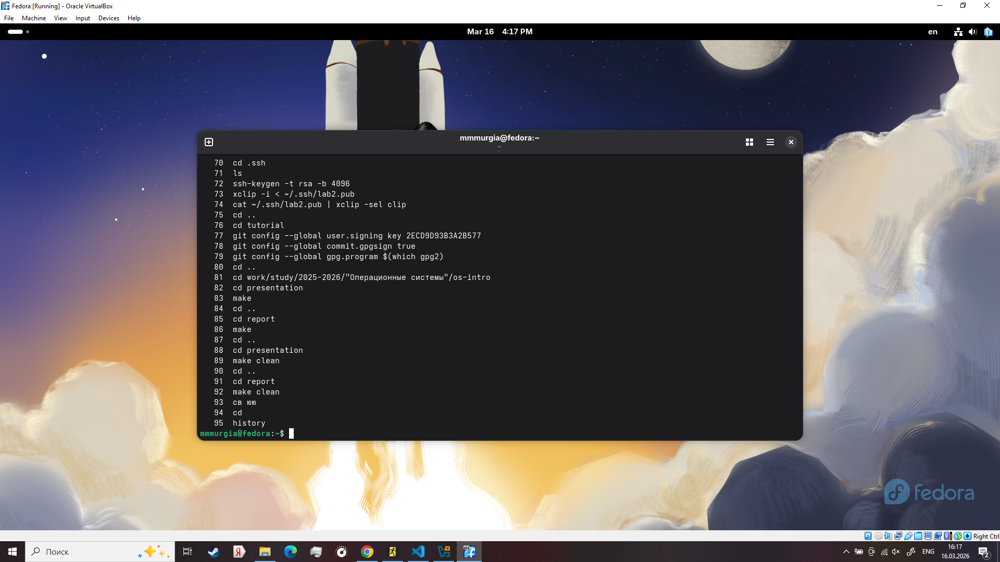

---
## Author
author:
  name: Мургия Марк Максимович
  degrees: DSc
  orcid: 0009-0006-9370-0808
  email: 1132243817@rudn.ru
  affiliation:
    - name: Российский университет дружбы народов
      country: Российская Федерация
      postal-code: 117198
      city: Москва
      address: ул. Миклухо-Маклая, д. 6

## Title
title: "Отчет Лабораторной работы №6"
subtitle: "Основы интерфейса взаимодействия пользователя с системой Unix на уровне командной строки"
license: "CC BY"
---

# Цель работы

Приобретение практических навыков взаимодействия пользователя с системой посредством командной строки.

# Задание

1. Узнать команды разных видов
2. Работать с каталогами

# Теоретическое введение

Команда man используется для просмотра (оперативная помощь) в диалоговом режиме руководства (manual) по основным командам операционной системы типа Linux.

Команда cd используется для перемещения по файловой системе операционной системы типа Linux.

Для определения абсолютного пути к текущему каталогу используется команда pwd (print working directory).

Команда ls используется для просмотра содержимого каталога.

Команда mkdir используется для создания каталогов.

Команда rm используется для удаления файлов и/или каталогов.

Для вывода на экран списка ранее выполненных команд используется команда history.

# Выполнение лабораторной работы

В домашнем каталоге ~ нужно сделать каталоги newdir и morefun через mkdir. ls используется разными методами. Нужно использовать man для все ранее упомянутых команд. history показывает историю всех ваших действий.

{#fig-001 width=100%}

# Выводы

Мы приобрели практические навыки взаимодействия пользователя с системой посредством командной строки.

# Список литературы{.unnumbered}

::: {#refs}
:::
