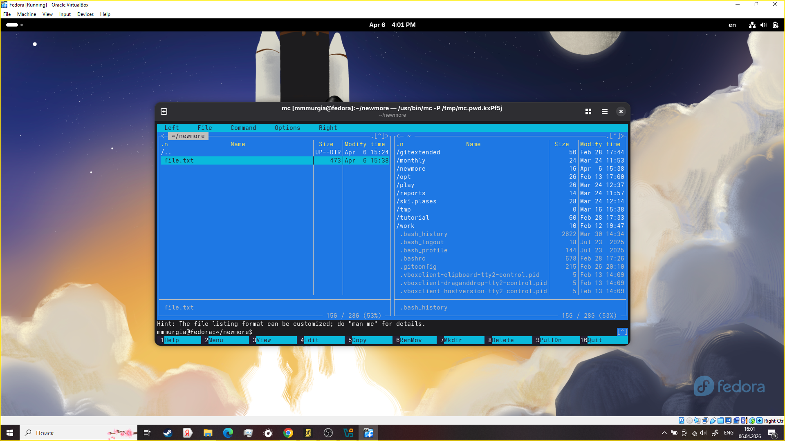

---
## Author
author:
  name: Мургия Марк Максимович
  degrees: DSc
  orcid: 0009-0006-9370-0808
  email: 1132243817@rudn.ru
  affiliation:
    - name: Российский университет дружбы народов
      country: Российская Федерация
      postal-code: 117198
      city: Москва
      address: ул. Миклухо-Маклая, д. 6

## Title
title: "Отчет Лабораторной работы №9"
subtitle: "Командная оболочка Midnight Commander"
license: "CC BY"
---

# Цель работы

Освоение основных возможностей командной оболочки Midnight Commander. Приобретение навыков практической работы по просмотру каталогов и файлов; манипуляций с ними.

# Задание

1. Ознакомиться с Midnight Commander
2. Сделать лабораторную работу

# Теоретическое введение

В [табл. @tbl-std-dir] показаны функциональные клавиши в Midnight Commander

| Клавиши | Функция                                                                                                                   |
|---------|---------------------------------------------------------------------------------------------------------------------------|
| `F1`    | Вызов контекстно-зависимой подсказки                                                                                      |
| `F2`    | Вызов пользовательского меню с возможностью создания и/или дополнения дополнительных функций                              |
| `F3`    | Просмотр содержимого файла, на который указывает подсветка в активной панели (без возможности редактирования)             |
| `F4`    | Вызов встроенного в mc редактора для изменения содержания файла, на который указывает подсветка в активной панели         |
| `F5`    | Копирование одного или нескольких файлов, отмеченных в первой (активной) панели, в каталог, отображаемый на второй панели |
| `F6`    | Перенос одного или нескольких файлов, отмеченных в первой (активной) панели, в каталог, отображаемый на второй панели     |
| `F7`    | Создание подкаталога в каталоге, отображаемом в активной панели                                                           |
| `F8`    | Удаление одного или нескольких файлов (каталогов), отмеченных в первой (активной) панели файлов                           |
| `F9`    | Вызов меню mc                                                                                                             |
| `F10`   | Выход из mc                                                                                                               |

: Функциональные клавиши mc {#tbl-std-dir}

# Выполнение лабораторной работы

{#fig-001 width=70%}

На протяжении лабораторной работы мы должны использовать mc. Создавать файл, редактировать, найти файлы.

# Контрольные вопросы

1. Режим Информация показывает информацию о выбранном файле. Режим Дерево показывает файловую систему в виде дерева.
2. Операции с файлами:
  1. Копирование – cp
  2. Перемещение - mv
  3. Удаление - rm
  4. Создание каталога - mkdir
  5. Просмотр - view
  6. Редактирование - edit
  7. Изменение прав доступа- chmod
3. Меню левой и правой панелей в Midnight Commander управляют режимом отображения файлов: списки (полный, укороченный), иерархия, «быстрый просмотр» или инфо-панель
4. В меню Файл содержит перечень команд, которые могут быть применены к одному или нескольким файлам или каталогам
5. В меню Команда содержатся более общие команды для работы с mc
6. Меню Настройки содержит ряд дополнительных опций по внешнему виду и функциональности mc
7. Встроенные команды mc: [табл. @tbl-std-dir]
8. Команды встроенного редактора mc:
  1. Ctrl+C — Отмена выделения блока.
  2. Ctrl+Y — Удалить текущую строку.
  3. Ctrl+U — Отменить последнее действие (Undo).
  4. Ctrl+A — Переход в начало строки.
  5. Ctrl+E — Переход в конец строки.
  6. Ctrl+S — Поиск строки (активный поиск).
  7. Ctrl+R — Замена текста.
  8. Alt+F5 — Форматирование абзаца.
  9. Alt+Enter — Дополнить слово (автодополнение).
9. Commander (файл ~/.mc.menu или /etc/mc/mc.menu) позволяют автоматизировать рутинные задачи, определяя собственные команды, выполняемые по нажатию F2. Меню поддерживает текстовый формат, горячие клавиши, подменю и параметры, обеспечивая гибкую интеграцию скриптов и внешних команд. 
10. В Midnight Commander (mc) основными средствами для выполнения пользовательских действий над текущим файлом являются Меню пользователя (User Menu, F2) и Ассоциации файлов (File Extension Edit, F2 в панели -> «Меню правки»). Они позволяют автоматизировать работу, запуская скрипты или команды для выбранного объекта.

# Выводы

Мы освоили основные возможности командной оболочки Midnight Commander и приобрели навыки практической работы по просмотру каталогов и файлов.

# Список литературы{.unnumbered}

::: {#refs}
:::
