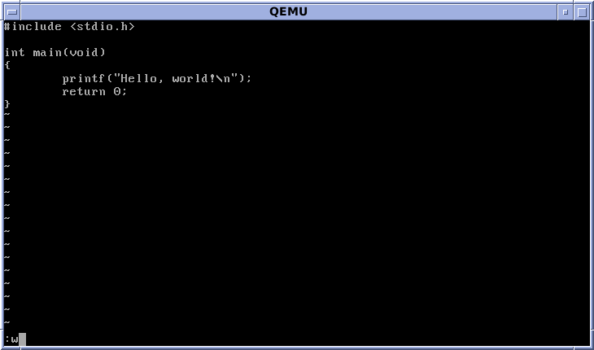

---
## Author
author:
  name: Мургия Марк Максимович
  degrees: DSc
  orcid: 0009-0006-9370-0808
  email: 1132243817@rudn.ru
  affiliation:
    - name: Российский университет дружбы народов
      country: Российская Федерация
      postal-code: 117198
      city: Москва
      address: ул. Миклухо-Маклая, д. 6

## Title
title: "Отчет Лабораторной работы №10"
subtitle: " Текстовой редактор vi"
license: "CC BY"
---

# Цель работы

Познакомиться с операционной системой Linux. Получить практические навыки работы с редактором vi, установленным по умолчанию практически во всех дистрибутивах.

# Задание

1. Ознакомиться с теоретическим материалом.
2. Ознакомиться с редактором vi.
3. Выполнить упражнения, используя команды vi.

# Теоретическое введение

Здесь описываются теоретические аспекты, связанные с выполнением работы.

Например, в [табл. @tbl-std-dir] приведено краткое описание стандартных каталогов Unix.

| Имя каталога | Описание каталога                                                                                                          |
|--------------|----------------------------------------------------------------------------------------------------------------------------|
| `/`          | Корневая директория, содержащая всю файловую                                                                               |
| `/bin `      | Основные системные утилиты, необходимые как в однопользовательском режиме, так и при обычной работе всем пользователям     |
| `/etc`       | Общесистемные конфигурационные файлы и файлы конфигурации установленных программ                                           |
| `/home`      | Содержит домашние директории пользователей, которые, в свою очередь, содержат персональные настройки и данные пользователя |
| `/media`     | Точки монтирования для сменных носителей                                                                                   |
| `/root`      | Домашняя директория пользователя  `root`                                                                                   |
| `/tmp`       | Временные файлы                                                                                                            |
| `/usr`       | Вторичная иерархия для данных пользователя                                                                                 |

: Описание некоторых каталогов файловой системы GNU Linux {#tbl-std-dir}

# Выполнение лабораторной работы

Используя Редактор vi нам нужно создать файл hello.sh и редактировать его как положено. Внизу показан пример экрана vi.

{#fig-001 width=70%}

# Контрольные вопросы

1. Редактор vi — это модальный редактор, работающий преимущественно в трех режимах: командном (обычном), режиме вставки (ввода текста) и режиме командной строки. В командном режиме осуществляется навигация и правка, в режиме вставки — набор текста, а в командной строке — сохранение и выход.
2. :q!
3. 0 - переход в начало строки; $ - переход в конец строки; G - переход в конец файла; nG - переход на строку с номером n
4. При использовании прописных W и B под разделителями понимаются только пробел, табуляция и возврат каретки. При использовании строчных w и b под разделителями понимаются также любые знаки пунктуации.
5. 0 - переход в начало строки; G - переход в конец файла
6. Редактор vi работает в трех основных режимах: командном (управление), вставки (ввод текста) и последней строки (сохранение/выход). Ключевые группы команд — это перемещение, редактирование, вставка, поиск и работа с файлами, выполняемые преимущественно в командном режиме (нажатие Esc). x — удалить символ под курсором; dd — удалить (вырезать) текущую строку; dw — удалить слово; r — заменить один символ; u — отменить последнее действие (undo).
7. i $
8. u — отменить последнее изменение
9. Режим последней строки в vi/vim (вход по :) предназначен для выполнения сложных команд: сохранения, выхода, поиска/замены и настроек. Основные группы включают управление файлами, поиск/замену, редактирование текста, работу с окнами и настройку параметров среды, обеспечивая выполнение команд над всем файлом или его частями. :w — записать изменённый текст в файл, не выходя из vi; :w имя-файла — записать изменённый текст в новый файл с именем имя-файла; :w! имя-файла — записать изменённый текст в файл с именем имя-файла; :wq — записать изменения в файл и выйти из vi; :q — выйти из редактора vi
10. Чтобы определить позицию конца строки в vi/vim, не перемещая курсор, используйте отображение номера колонки.
11. :set all — вывести полный список опций; :set nu — вывести номера строк; :set list — вывести невидимые символы; :set ic — не учитывать при поиске, является ли символ прописным или строчным
12. Определить режим работы в редакторе vi (или vim) можно по нижней строке состояния или по реакции на нажатие клавиш: если внизу отображается -- INSERT -- или ничего не происходит при вводе букв, вы в режиме ввода. Если реакции нет, а нажатие клавиш вызывает команды, вы в командном режиме.

# Выводы

Мы получили практические навыки работы с редактором vi, установленным по умолчанию практически во всех дистрибутивах.

# Список литературы{.unnumbered}

::: {#refs}
:::
