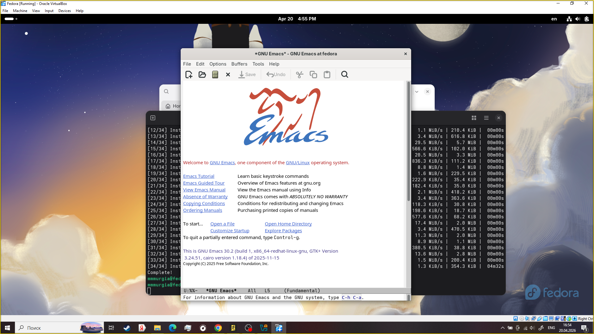

---
## Author
author:
  name: Мургия Марк Максимович
  degrees: DSc
  orcid: 0009-0006-9370-0808
  email: 1132243817@rudn.ru
  affiliation:
    - name: Российский университет дружбы народов
      country: Российская Федерация
      postal-code: 117198
      city: Москва
      address: ул. Миклухо-Маклая, д. 6

## Title
title: "Отчет Лабораторной работы №11"
subtitle: " Текстовой редактор emacs"
license: "CC BY"
---

# Цель работы

Познакомиться с операционной системой Linux. Получить практические навыки работы с редактором Emacs.

# Задание

1. Ознакомиться с теоретическим материалом.
2. Ознакомиться с редактором emacs.
3. Выполнить упражнения.
4. Ответить на контрольные вопросы.

# Теоретическое введение

Буфер — объект, представляющий какой-либо текст.

Фрейм соответствует окну в обычном понимании этого слова. Каждый фрейм содержит область вывода и одно или несколько окон Emacs.

Окно — прямоугольная область фрейма, отображающая один из буферов.

Область вывода — одна или несколько строк внизу фрейма, в которой Emacs выводит различные сообщения, а также запрашивает подтверждения и дополнительную информацию от пользователя.

Минибуфер используется для ввода дополнительной информации и всегда отображается в области вывода.

Точка вставки — место вставки (удаления) данных в буфере.

# Выполнение лабораторной работы

Emacs - семейство многофункциональных расширяемых текстовых редакторов. Нужно его установить на нашу виртуальную машину.

Далее нужно работать с файлом lab07.sh используя в основном комбинации клавишь и окна.

{#fig-001 width=70%}

# Контрольные вопросы

1. Emacs — это мощный, свободно распространяемый, расширяемый и настраиваемый текстовый редактор, часто используемый как полноценная среда разработки (IDE) и «операционная система» внутри Linux/Unix.
2. Его сложность для новичков обусловлена не столько отсутствием функций, сколько философией, возрастом и подходом к работе.
3. Буфер - это то место в оперативной памяти, где реально живет текст, который вы редактируете. Это может быть открытый файл, вывод команды, список файлов (Dired) или просто черновик. Окно - это физическая область на вашем экране, через которую вы смотрите на буфер. Окно — это «рамка»
4. Каждое окно Emacs отображает в одно время один буфер. Один и тот же буфер может появиться более чем в одном окне
5. По умолчанию, новый созданный буфер будет копией текущего буфера
6. Ctrl + c
7. C-x 2 горизонтально, друг над другом; C-x 3 вертикально, рядом
8. Настройки редактора Emacs хранятся в домашней директории пользователя в файле ~/.emacs, ~/.emacs.el или в ~/.emacs.d/init.el (последний вариант считается современным стандартом).
9. В Emacs клавиша Backspace (часто обозначаемая как DEL или delete) по умолчанию удаляет один символ, стоящий слева от курсора (назад). 
10. Я бы сказал что emacs удобнее благодаря интерфейсу.

# Выводы

Мы получили практические навыки работы с редактором Emacs.

# Список литературы{.unnumbered}

::: {#refs}
:::
