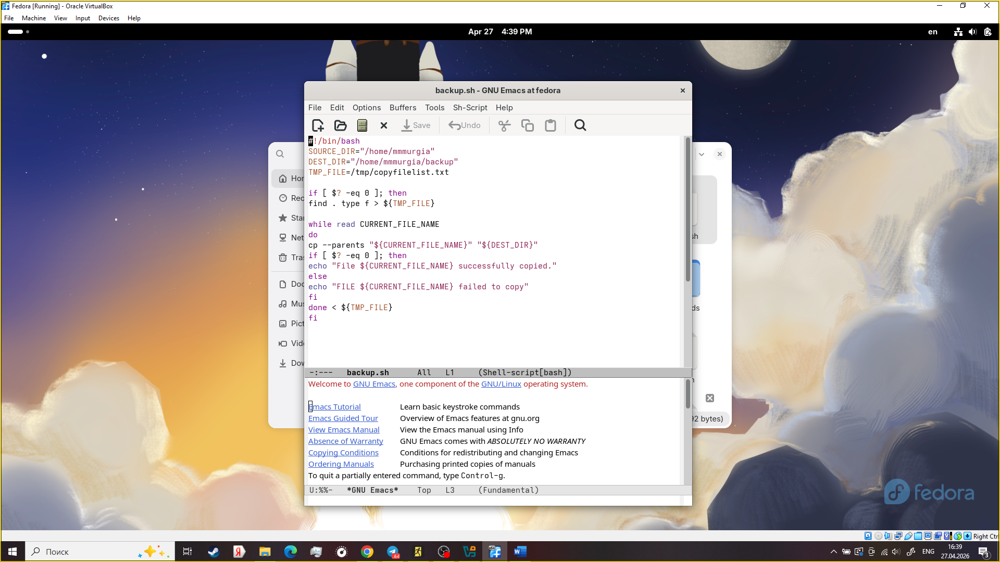

---
## Author
author:
  name: Мургия Марк Максимович
  degrees: DSc
  orcid: 0009-0006-9370-0808
  email: 1132243817@rudn.ru
  affiliation:
    - name: Российский университет дружбы народов
      country: Российская Федерация
      postal-code: 117198
      city: Москва
      address: ул. Миклухо-Маклая, д. 6

## Title
title: "Отчет Лабораторной работы №12"
subtitle: "Программирование в командном процессоре ОС UNIX. Командные файлы"
license: "CC BY"
---

# Цель работы

Изучить основы программирования в оболочке ОС UNIX/Linux. Научиться писать небольшие командные файлы.

# Задание

1. Написать скрипт, который при запуске будет делать резервную копию самого себя (то есть файла, в котором содержится его исходный код) в другую директорию backup в вашем домашнем каталоге. При этом файл должен архивироваться одним из архиваторов на выбор zip, bzip2 или tar. Способ использования команд архивации необходимо узнать, изучив справку.
2. Написать пример командного файла, обрабатывающего любое произвольное число аргументов командной строки, в том числе превышающее десять. Например, скрипт может последовательно распечатывать значения всех переданных аргументов.
3. Написать командный файл — аналог команды ls (без использования самой этой команды и команды dir). Требуется, чтобы он выдавал информацию о нужном каталоге и выводил информацию о возможностях доступа к файлам этого каталога.
4. Написать командный файл, который получает в качестве аргумента командной строки формат файла (.txt, .doc, .jpg, .pdf и т.д.) и вычисляет количество таких файлов в указанной директории. Путь к директории также передаётся в виде аргумента командной строки.

# Теоретическое введение

| Оператор | Синтаксис   | Результат                                      |
|----------|-------------|------------------------------------------------|
| `!`      | !exp        | Если exp равно 0, то возвращает 1; иначе 0     |
| `%`      | exp1 !=exp2 | Возвращает остаток от деления ехр1 на ехр2     |
| `&`      | exp1%exp2   | Возвращает побитовое AND выражений ехр1 и ехр2 |
| `*`      | exp1 * exp2 | Умножает ехр1 на ехр2                          |
| `+`      | exp1 + exp2 | Складывает ехр1 и ехр2                         |
| `-`      | exp1 - exp2 | Вычитает exp2 из exp1                          |
| `/`      | exp1 / exp2 | Делит exp1 на exp2                             |
| `=`      | var = exp   | Присваивает значение exp переменной var        |

: Арифметические операторы оболочки bash {#tbl-std-dir}

# Выполнение лабораторной работы

{#fig-001 width=70%}

# Контрольные вопросы

1. Командная оболочка Unix (shell) — это текстовый интерфейс (интерпретатор команд), который выступает посредником между пользователем и ядром операционной системы.
2. POSIX (Portable Operating System Interface for Computer Environments) — набор стандартов описания интерфейсов взаимодействия операционной системы и прикладных программ.
3. В Bash переменные и массивы определяются довольно просто, при этом Bash является слаботипизированным языком, где большинство данных обрабатывается как строки.
4. Команда let является показателем того, что последующие аргументы представляют собой выражение, подлежащее вычислению.
Команда read позволяет читать значения переменных со стандартного ввода
5. [Таблица @tbl-std-dir]
6. Для облегчения программирования можно записывать условия оболочки bash в двойные скобки
7. PATH, HOME, USER, PWD, SHELL, BASH, HOSTNAME
8. Такие символы, как ' < > * ? | \ " &, являются метасимволами и имеют для командного процессора специальный смысл.
9. Экранирование может быть осуществлено с помощью предшествующего метасимволу символа \, который, в свою очередь, является метасимволом.
10. bash командный_файл [аргументы]
11. Функции в Bash определяются как именованные блоки кода, которые выполняют определенные задачи и могут быть повторно использованы. Они создаются с помощью имени, за которым следуют пустые скобки (), а тело функции заключается в фигурные скобки { ... }.
12. По цвету шрифта
13. Для создания массива используется команда set. Если использовать typeset -i для объявления и присвоения переменной, то при последующем её применении она станет целой. Изъять переменную из программы можно с помощью команды unset.
14. Параметры в bash-скрипты передаются через командную строку, указываясь после имени файла через пробел. Внутри скрипта они доступны как позиционные переменные: 1 (первый), 2 (второй) и т.д.. Специальная переменная 0 содержит имя самого скрипта, # — количество аргументов, а @
15. В Bash специальные переменные (предопределенные параметры) используются для управления скриптами, получения аргументов и анализа состояния системы. Ключевые из них: 0 (имя скрипта), # (число аргументов), /*’(аргументы)’, ?(код завершения) и$$` (PID процесса). Они автоматически обновляются оболочкой.

# Выводы

Мы научились писать небольшие командные файлы.

# Список литературы{.unnumbered}

::: {#refs}
:::
