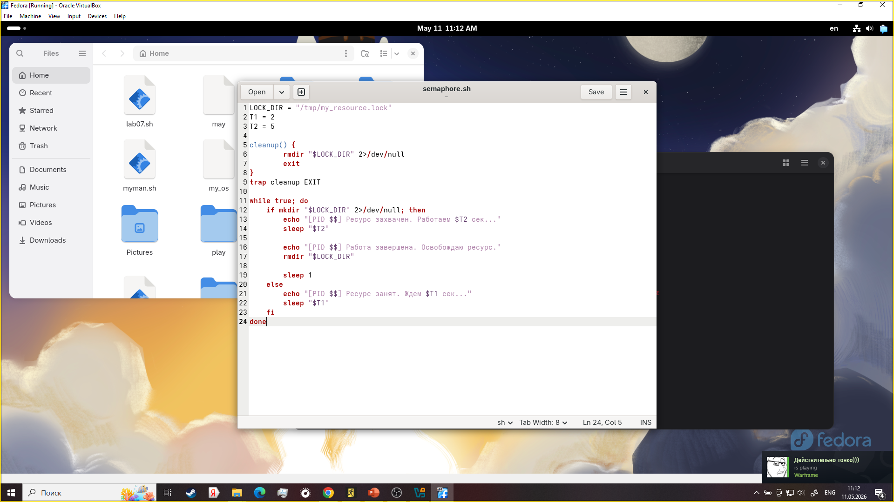
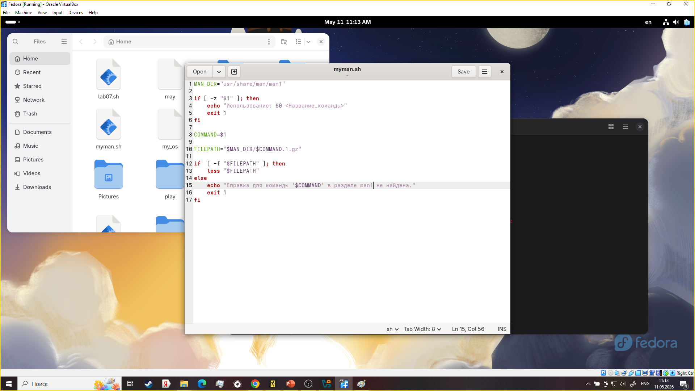
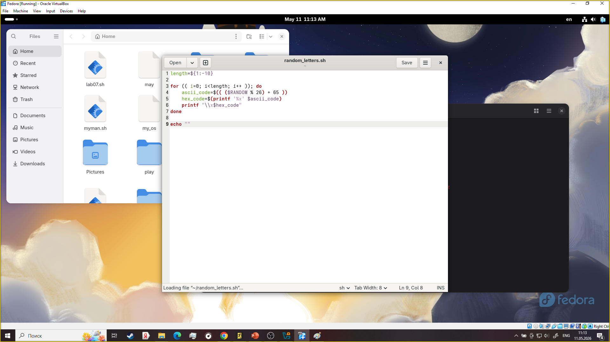
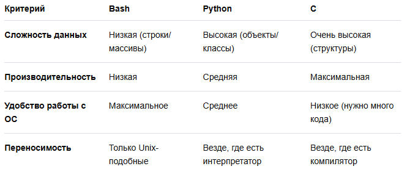

---
## Author
author:
  name: Мургия Марк Максимович
  degrees: DSc
  orcid: 0009-0006-9370-0808
  email: 1132243817@rudn.ru
  affiliation:
    - name: Российский университет дружбы народов
      country: Российская Федерация
      postal-code: 117198
      city: Москва
      address: ул. Миклухо-Маклая, д. 6

## Title
title: "Отчет Лабораторной работы №14"
subtitle: "Программирование в командном процессоре ОС UNIX. Расширенное программирование"
license: "CC BY"
---

# Цель работы

Изучить основы программирования в оболочке ОС UNIX. Научиться писать более сложные командные файлы с использованием логических управляющих конструкций и циклов.

# Задание

Создать 3 сложных командных файлов.

# Теоретическое введение

Здесь описываются теоретические аспекты, связанные с выполнением работы.

Например, в [табл. @tbl-std-dir] приведено краткое описание стандартных каталогов Unix.

| Имя каталога | Описание каталога                                                                                                          |
|--------------|----------------------------------------------------------------------------------------------------------------------------|
| `/`          | Корневая директория, содержащая всю файловую                                                                               |
| `/bin `      | Основные системные утилиты, необходимые как в однопользовательском режиме, так и при обычной работе всем пользователям     |
| `/etc`       | Общесистемные конфигурационные файлы и файлы конфигурации установленных программ                                           |
| `/home`      | Содержит домашние директории пользователей, которые, в свою очередь, содержат персональные настройки и данные пользователя |
| `/media`     | Точки монтирования для сменных носителей                                                                                   |
| `/root`      | Домашняя директория пользователя  `root`                                                                                   |
| `/tmp`       | Временные файлы                                                                                                            |
| `/usr`       | Вторичная иерархия для данных пользователя                                                                                 |

: Описание некоторых каталогов файловой системы GNU Linux {#tbl-std-dir}

Более подробно про Unix см. в [@tanenbaum_book_modern-os_ru; @robbins_book_bash_en; @zarrelli_book_mastering-bash_en; @newham_book_learning-bash_en].

# Выполнение лабораторной работы

{#fig-001 width=70%}

{#fig-002 width=70%}

{#fig-003 width=70%}

# Контрольные вопросы

1. Нет пробелов
2. Нужно записать переменные или текст друг за другом внутри кавычек или без них.
3. echo {1..5} start=1 end=5 for ((i=start; i<=end; i++)); do echo "$i" done i=1 while [ $i -le 5 ]; do echo "$i" ((i++)) done
4. В Bash встроенная арифметика $((...)) выполняет только целочисленное деление.
5. Улучшенное автодополнение, Глоббинг (поиск файлов), Коррекция опечаток, Кастомизация и плагины, Работа с массивами, Совместимость
6. Верен
7. {#fig-004 width=70%}

# Выводы

Мы научились писать более сложные командные файлы с использованием логических управляющих конструкций и циклов.

# Список литературы{.unnumbered}

::: {#refs}
:::
