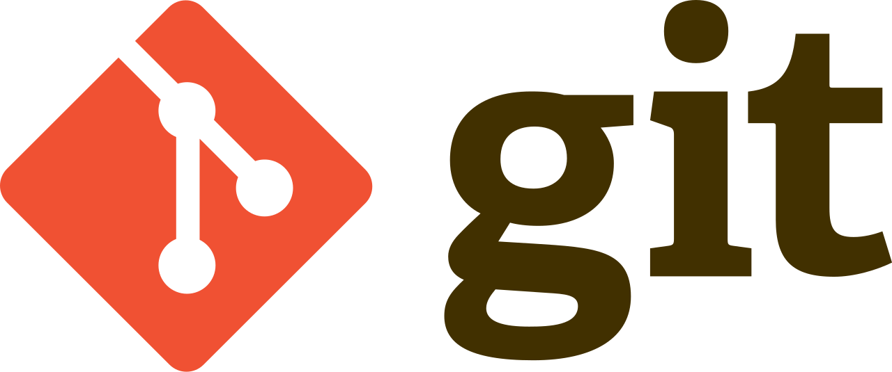
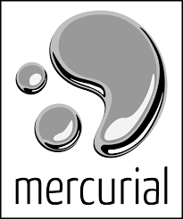
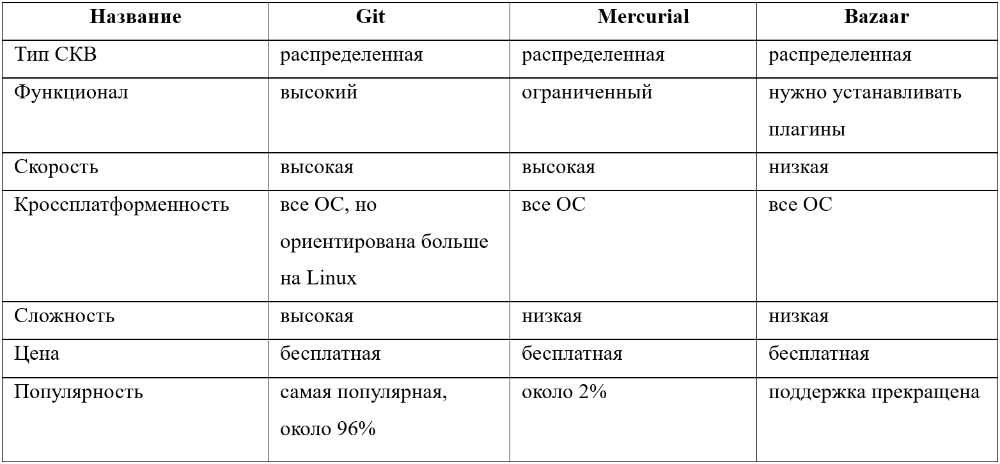

---
## Author
author:
  name: Мургия Марк Максимович
  degrees: DSc
  orcid: 0009-0006-9370-0808
  email: 1132243817@rudn.ru
  affiliation:
    - name: Российский университет дружбы народов
      country: Российская Федерация
      postal-code: 117198
      city: Москва
      address: ул. Миклухо-Маклая, д. 6
## Title
title: Git, Mercurial, Bazaar
subtitle: Сравнение систем управления версиями
license: CC BY
date: today
date-format: "YYYY-MM-DD" # Example: 2025-09-06
---

## Содержание

1. [Актуальность темы](#актуальность-темы)
2. [Типы систем контроля версий](#типы-систем-контроля-версий)
3. [Git](#git)
4. [Mercurial](#merculiar)
5. [Bazaar](#bazaar)
6. [Сравнительная таблица Git, Mercurial, Bazaar](#сравнительная-таблица-git-mercurial-bazaar)
7. [Перспективы развития](#перспективы-развития-git)
8. [Заключение](#заключение)

## О себе

:::::::::::::: {.columns align=center}
::: {.column width="70%"}

  * Мургия Марк Максимович
  * Кафедра Прикладная информатика
  * Студент НПИбд-02-25
  * Российский университет дружбы народов им. П. Лумумбы
  * [1132243817@rudn.ru](mailto:1132243817@rudn.ru)

:::
::: {.column width="30%"}

:::
::::::::::::::

## Актуальность темы

В настоящее время разработка ПО — это сложный процесс, в котором участвует множество сотрудников. Каждый из них вносит свои изменения в программный код. Поэтому выбор оптимальной системы управления версиями — не просто технический вопрос, а стратегическое решение, которое может повлиять на всю организацию процесса разработки (скорость, качество кода, безопасность данных, эффективность взаимодействия в команде).  

Объект исследования: системы контроля версий (Git, Mercurial, Bazaar)

Предмет исследования: особенности, преимущества, недостатки, популярность Git, Mercurial, Bazaar

Цель и задачи исследования: ознакомиться с системами контроля версий Git, Mercurial, Bazaar, сравнить их и сделать вывод об их популярности и о перспективах развития.

## Типы систем контроля версий

Централизованные (CSV, Subversion, Perforce) 

Есть центральный сервер, на котором хранятся все данные, и ряд клиентов, получающих из него копии файлов. 

Распределенные (Git, Mercurial, Bazaar)

Все изменения хранятся в локальном хранилище на компьютере и при необходимости синхронизируются с другими. Устраняется зависимость от центрального сервера, можно вести работу без сетевого соединения с ним. [1](http://synergy-journal.ru/archive/article1590)

## Git

:::::::::::::: {.columns align=center}
::: {.column width="70%"}

  * Год создания и автор: 2005, Linus Torvalds
  * Основные особенности: уникальная внутренняя архитектура, высокая производительность и гибкость
  * Уровень популярности: самая популярная, используют 96.65% разработчиков (данные за 2025 год)
  * Проекты, использующие Git: ядро Linux, Swift, Android, Drupal, Cairo, GNU Core Utilities, Mesa, Wine, Chromium, Compiz Fusion, FlightGear, jQuery, PHP, NASM, MediaWiki, DokuWiki, Qt, ряд дистрибутивов Linux. [2](https://ru.wikipedia.org/wiki/)

:::
::: {.column width="30%"}

:::
::::::::::::::

## Особенности

Версии хранятся в двух репозиториях: локальном на компьютере разработчика и удаленном (на сервере). Получение данных с удаленного репозитория идет через гит-хостинги, например Github.

Изменения и новые версии сохраняются в локальном репозитории, происходит синхронизация локального и удаленного репозиториев.

## Преимущества и недостатки

- Высокая скорость проведения всех операций (нет сетевой задержки)
- Идеальные условия для командной разработки
- Страховка от потери информации при возникновении проблем с центральным сервером
- Сложность обучения
- Есть проблемы при работе с бинарными файлами
- Ограниченная поддержка Windows по сравнению с Linux [3](https://skillbox.ru/media/code/chto_takoe_git_obyasnyaem_na_skhemakh/)

## Merculiar

:::::::::::::: {.columns align=center}
::: {.column width="70%"}

  * Год создания и автор: 2005, Matt Mackall
  * Основные особенности: написана на Python, простые для освоения команды, интерфейс более понятен по сравнению с Git
  * Уровень популярности: низкая, около 2% рынка ПО (данные на 2024 год)
  * Проекты, использующие Mercurial: Facebook [2](https://ru.wikipedia.org/wiki/)

:::
::: {.column width="30%"}

:::
::::::::::::::

## Преимущества и недостатки

- Кроссплатформенность. Работает со всеми основными ОС — Windows, Linux и MacOS. Это упрощает совместную работу над проектом, если пользователи используют разные платформы
- Поддержка бинарных файлов — система оптимизирована для работы как с текстовыми, так и с бинарными данными
- Открытый исходный код: это бесплатное программное обеспечение 
- Удобство: понятная структура каталога изменений, работа через консоль или через графический интерфейс 
- Небольшой вес: занимает немного места на жестком диске, не требует больших затрат аппаратных ресурсов. Подходит для пользователей с маломощными компьютерами. 
- Не очень удобный графический интерфейс
- Ограниченный (по сравнению с Git) функционал [4](https://blog.skillfactory.ru/glossary/mercurial/)

## Bazaar

:::::::::::::: {.columns align=center}
::: {.column width="70%"}

  * Год создания и автор: 2005, Martin Pool, при поддержке компании Canonical
  * Основные особенности: свободное ПО, написана на языке Python
  * Уровень популярности: 2016 - последний релиз, 2025 - Canonical прекратила поддержку Bazaar
  * Проекты, использующие Bazaar: несколько открытых проектов (компьютерная игра Armagetron Advanced, компоненты Ubuntu) [2](https://ru.wikipedia.org/wiki/)

:::
::: {.column width="30%"}

.svg.png)

:::
::::::::::::::

## Преимущества

- Кросплатформенная поддержка: работает под управлением операционных систем Linux, Mac OS X и Windows
- Удобный и интуитивно понятный интерфейс
- Простая работа с ветками проекта
- Возможность работы с репозиториями других систем контроля версий

## Недостатки

- Более низкая скорость работы, по сравнению с Git и Mercurial
- Для полноценного функционирования нужно устанавливать большое количество плагинов
- 2016 - последний релиз Bazaar
- 2019-2021 - многие пользователи, и сама компания-разработчик Canonical перешли на Git
- 2025 - поддержка прекращена

## Сравнительная таблица Git, Mercurial, Bazaar

## Перспективы развития (Git)

:::::::::::::: {.columns align=center}
::: {.column width="50%"}

  * 2025 - вышла версия 2.49 Git
  * «Очень сильный сетевой эффект, из-за чего его трудно вытеснить» (из интервью Линуса Торвальдса 2025 года).
  * 96,65% разработчиков ПО используют Git (По опросу Stack Overflow 2025 года). [5](https://habr.com/ru/news/900344/)

:::
::: {.column width="50%"}

](./image/f0a882aee5ce2210413a8c30f59c01d4.jpg)

:::
::::::::::::::

## Перспективы развития (Mercurial, Bazaar)

- Mercurial

Альтернатива для работы с большими репозиториями, делает упор на свои преимущества.

- Bazaar

Активная разработка прекращена. Возвращение популярности маловероятно. Поддержка старых проектов, где она применялась ранее. 

## Заключение

Системы контроля версий необходимы в работе программиста, так как без них невозможно эффективно управлять процессом разработки ПО.

Самая популярная на сегодняшний день система контроля версий – это Git, ее используют большинство компаний. Поэтому иметь хотя бы базовые навыки работы с Git нужно всем. Но и другие системы могут больше подходить в определенных случаях.

Зная преимущества и недостатки вариантов, можно не только расширить кругозор, но и аргументированно выбирать СКВ для будущих проектов.

## Список использованной литературы

1. Кукарцев В.В., Бадарчы С.А. Сравнение систем контроля версий: GIT, MERCURIAL, CVS И SVN—[Электронный ресурс]. [1](http://synergy-journal.ru/archive/article1590) (дата обращения 09.03.2026)
2. Википедия – свободная энциклопедия — [Электронный ресурс]. [2](https://ru.wikipedia.org/wiki/) (дата обращения 09.03.2026) 
3. Что такое Git: объясняем на схемах—[Электронный ресурс]. [3](https://skillbox.ru/media/code/chto_takoe_git_obyasnyaem_na_skhemakh/) (дата обращения 09.03.2026)
4. Mercurial—[Электронный ресурс]. [4](https://blog.skillfactory.ru/glossary/mercurial/) (дата обращения 09.03.2026)
5. Линус Торвальдс в интервью инженеру-программисту GitHub Тейлору Блау рассказал о развитии проекта Git за 20 лет—[Электронный ресурс]. [5](https://habr.com/ru/news/900344/) (дата обращения 09.03.2026)

# Спасибо за внимание
