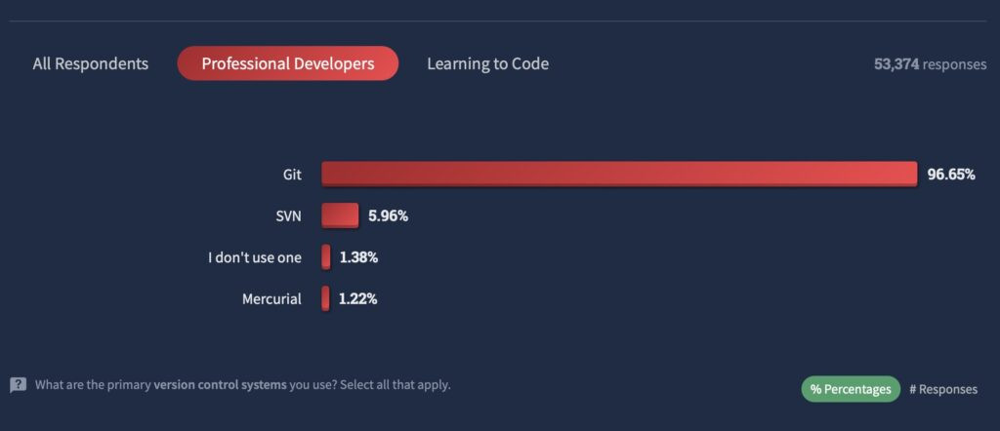

---
## Author
author:
  name: Мургия Марк Максимович
  degrees: DSc
  orcid: 0009-0006-9370-0808
  email: 1132243817@rudn.ru
  affiliation:
    - name: Российский университет дружбы народов
      country: Российская Федерация
      postal-code: 117198
      city: Москва
      address: ул. Миклухо-Маклая, д. 6

## Title
title: "Сравнение систем управления версиями git, mercurial и bazaar"
subtitle: "Дисциплина: Архитектура компьютеров и операционные системы"
license: "CC BY"
---

# ВВЕДЕНИЕ

В ходе разработки ПО программистам часто приходится редактировать и дорабатывать свой код. Если изменения кода не приводят к нужному результату, приходится возвращаться к более старым версиям. При работе над большими проектами очень важно регистрировать не только все изменения в файлах, но также когда и кем они были сделаны, чтобы не допускать путаницы и ошибок. Эти задачи решаются с помощью систем управления версиями (систем контроля версий СКВ или VCS — Version Control System).

Актуальность данной темы состоит в том, что выбор оптимальной системы управления версиями — не просто технический вопрос, а стратегическое решение, которое может повлиять на всю организацию процесса разработки (скорость, качество кода, безопасность данных, эффективность взаимодействия в команде).

Объектом исследования в данной работе являются системы контроля версий Git, Mercurial, Bazaar.

Предмет исследования — особенности, преимущества, недостатки, популярность Git, Mercurial, Bazaar.

Цель и задачи исследования: ознакомиться с системами контроля версий Git, Mercurial, Bazaar, сравнить их и сделать вывод об их популярности и перспективах развития. 
Реферат состоит из введения, основной части, заключения и списка литературы.

# Типы систем контроля версий (СКВ)

Существует два типа систем контроля версий: централизованные и распределенные.

В централизованных системах контроля версий (например, CSV, Subversion, Perforce) есть центральный сервер, на котором хранятся все данные, и ряд клиентов, получающих из него копии файлов. В таких системах всегда понятно, кто чем занимается в проекте, и их проще администрировать. Но для работы нужна постоянная связь с сервером. Если соединения с сервером нет, работа останавливается. Если диск на сервере поврежден, а бэкапов нет, можно потерять все данные.

В распределенных системах контроля версий у каждого разработчика на его компьютере есть локальная копия всего репозитория. В этом случае устраняется зависимость от центрального сервера, можно вести работу даже без сетевого соединения с ним, а потом синхронизировать изменения. При возникновении проблем с сервером репозиторий можно восстановить с компьютера любого разработчика. [@synergy]

Примеры распределённых СКВ: Git, Mercurial, Bazaar. Рассмотрим их подробнее.

# Git

Год создания и автор: 2005, Linus Torvalds.

Основные особенности: уникальная внутренняя архитектура, высокая производительность и гибкость.

Уровень популярности: самая популярная, используют 96,65% разработчиков (данные за 2025 год).

Проекты, использующие Git: ядро Linux, Swift, Android, Drupal, Cairo, GNU Core Utilities, Mesa, Wine, Chromium, Compiz Fusion, FlightGear, jQuery, PHP, NASM, MediaWiki, DokuWiki, Qt, ряд дистрибутивов Linux. [@wikipedia]

Версии в Git хранятся в двух репозиториях: локальном на компьютере разработчика (полный объем данных) и удаленном (на сервере). Получение данных с удаленного репозитория идет через гит-хостинги, например, Github. Любые изменения в документе и его новые версии сохраняются в локальном репозитории. Взаимодействие представляет собой просто синхронизацию локального и удаленного репозиториев. Команда push копирует новые данные, содержащиеся в локальном репозитории, в удалённый репозиторий, а команда pull передает данные из удаленного репозитория в локальный.

Рабочий процесс в Git может быть организован так:

1. Новый человек приходит в компанию и клонирует репозиторий проекта на ПК.
2. Получает задачу, создаёт новую ветку и пишет код.
3. Когда всё готово — отправляет запрос на добавление кода в master-ветку.
4. Другие разработчики смотрят код, оставляют комментарии и указывают на ошибки.
5. Новичок дорабатывает код, обновляет master-ветку и переходит к следующей задаче. [@skillbox]

Преимуществами Git являются: 

- Высокая скорость проведения всех операций (нет сетевой задержки).
- Идеальные условия для командной разработки.
- Страховка от потери информации при возникновении проблем с центральным сервером.

Недостатки Git:

- Сложность обучения.
- Есть проблемы при работе с большими бинарными файлами.
- Ограниченная поддержка Windows по сравнению с Linux. [@skillbox]

# Mercurial

Год создания и автор: 2005, Matt Mackall.

Основные особенности: написана на Python, простые для освоения команды, интерфейс более понятен по сравнению с Git.

Уровень популярности: низкая популярность, около 2% рынка ПО (данные за 2024 год).

Проекты, использующие Mercurial: Facebook

Начиная с 2019-2021 года всё больше проектов, долгое время использовавших Mercurial, переходят на Git (Mozilla, Nginx, OpenJDK). Только компания Facebook продолжает использовать Mercurial. [@wikipedia]

Mercurial — это набор написанных на языке Python скриптов, позволяющих сохранять различные версии кода в репозиториях. Некоторые компоненты написаны на C. В качестве физического хранилища можно использовать любую аппаратную платформу, не обязательно отдельный выделенный сервер, как в Git. Репозиториев можно создавать неограниченное количество (насколько хватит места) как на своем ПК, так и на компьютерах других пользователей.

Примерное описание рабочего процесса в Mercurial:

1. Пользователь создает новый локальный репозиторий на своем ПК (открывает новый или клонирует уже имеющийся).
2. В каталоге созданного репозитория редактирует, добавляет или удаляет файлы.
3. В локальном хранилище фиксируются изменения, внесенные в файлы.
4. Этапы 2 и 3 осуществляются столько раз, сколько необходимо для выполнения задачи.
5. Из локальных репозиториев на ПК других пользователей извлекаются и переносятся сделанные ими изменения, которые синхронизируются с теми, которые внес первый разработчик.
6. Пользователь отдает внесенные им в программный код изменения другим разработчикам. [@skillfactory]

Преимуществами Mercurial являются: 

- Кроссплатформенность. Работает со всеми основными ОС: Windows, Linux и MacOS. Это упрощает совместную работу над проектом, если пользователи используют разные платформы.
- Поддержка бинарных файлов: система оптимизирована для работы как с текстовыми, так и с бинарными данными.
- Удобство: понятная структура каталога изменений, работа через консоль или через графический интерфейс. 
- Небольшой вес: занимает немного места на жестком диске, не требует больших затрат аппаратных ресурсов. Подходит для пользователей с маломощными компьютерами.

Недостатки Mercurial:

- Основной инструмент для работы – консоль, может быть непривычно для новичков. Не очень удобный графический интерфейс. 
- Ограниченный (по сравнению с Git) функционал. [@skillfactory]

# Bazaar

Год создания и автор: 2005, Martin Pool, при поддержке компании Canonical.

Основные особенности: свободное ПО, написана на языке Python.

Уровень популярности: 2016 — последний релиз, 2025 — Canonical прекратила поддержку Bazaar.

Проекты, использующие Bazaar: несколько открытых проектов (компьютерная игра Armagetron Advanced, компоненты Ubuntu) [@wikipedia]

Несмотря на то, что Bazaar уже не популярна, у нее есть некоторые достоинства, например:

- Кросплатформенность. Работает под управлением операционных систем Linux, Mac OS X и Windows. 
- Удобный и интуитивно понятный интерфейс. 
- Простая работа с ветками проекта: модель разработки с центральной веткой (trunk), которая содержит законченные результаты работы (только проверенный и рабочий код) и множеством рабочих веток (features branches — ветки для разработки новых функций), которые используются разработчиками. 
- Возможность работы с репозиториями других систем контроля версий. Bazaar поддерживает работу напрямую с некоторыми другими СКВ. Пользователи могут создавать новые ветки на основе репозиториев других систем (например, Subversion или Git), делать локальные изменения и фиксировать их в Bazaar-ветке, и затем отправлять свои изменения назад в оригинальный репозиторий. [@wikipedia]

К недостаткам Bazaar относятся:

- Более низкая скорость работы, по сравнению с Git и Mercurial. 
- Для полноценного функционирования нужно устанавливать большое количество плагинов. [@wikipedia]
- Последний релиз Bazaar был выпущен в 2016 году, а в 2025 году поддержка была остановлена. Уже с 2019-2021 года многие пользователи, а также сама компания-разработчик Canonical, перешли на Git.

# Сравнение Git, Mercurial, Bazaar

Сравним характеристики трех систем контроля версий [табл. @tbl-std-dir].

| Название             | Git                                      | Mercurial      | Bazaar                      |
|----------------------|------------------------------------------|----------------|-----------------------------|
| Тип СКВ              | Распределенная                           | Распределенная | Распределенная              |
| Функционал           | Высокий                                  | Ограниченный   | Нужно устанавливать плагины |
| Кроссплатформенность | Все ОС, но ориентирована больше на Linux | Все ОС         | Все ОС                      |
| Скорость             | Высокая                                  | Высокая        | Низкая                      |
| Сложность            | Высокая                                  | Низкая         | Низкая                      |
| Цена                 | Бесплатная                               | Бесплатная     | Бесплатная                  |
| Популярность         | самая популярная, около 96%              | около 2%       | поддержка прекращена        |

: Сравнение характеристик Git, Mercurial, Bazaar {#tbl-std-dir}

Из таблицы 1 следует, что из трех систем контроля версий Git имеет самый большой функционал, работает со всеми операционными системами, но больше ориентирован на Linux, более сложен в освоении, самый популярный.

# Перспективы развития

Рассмотрим перспективы развития этих трех систем.

## Git

Проект продолжает развиваться и улучшаться. В 2025 году Линус Торвальдс дал интервью, в котором сказал, что у Git «очень сильный сетевой эффект, из-за чего его трудно вытеснить». В марте 2025 года вышла версия 2.49 Git.

Согласно опросу Stack Overflow, 96,65% профессиональных разработчиков используют Git. [@habr]

{#fig-001 width=70%}

## Mercurial

Продолжает развиваться как альтернатива для работы с большими репозиториями, делая упор на свои преимущества: удобные механизмы управления ветками и более простую кривую обучения по сравнению с Git. Не стремится к доминированию, а фокусируется на качестве и стабильности для своей целевой аудитории.

## Bazaar

Фактически проиграла другим системам на рынке ПО. Активная разработка прекращена. Возвращение популярности маловероятно. Ее будущее - поддержка старых проектов, где она применялась ранее. 

# Заключение

Основываясь на кратком обзоре и сравнении трех систем контроля версий, можно подвести итоги.

Системы контроля версий необходимы в работе программиста, так как без них невозможно эффективно управлять процессом разработки ПО.

Самая популярная на сегодняшний день система контроля версий – это Git, ее используют большинство компаний. Поэтому иметь хотя бы базовые навыки работы с Git нужно всем. Но и другие системы могут больше подходить в определенных случаях.

Зная преимущества и недостатки вариантов, можно не только расширить кругозор, но и аргументированно выбирать СКВ для будущих проектов.

# СПИСОК ИСПОЛЬЗОВАННОЙ ЛИТЕРАТУРЫ{.unnumbered}

::: {#refs}
:::
